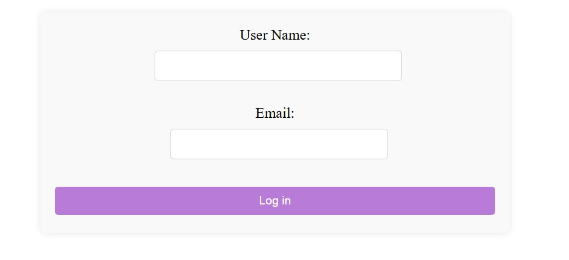
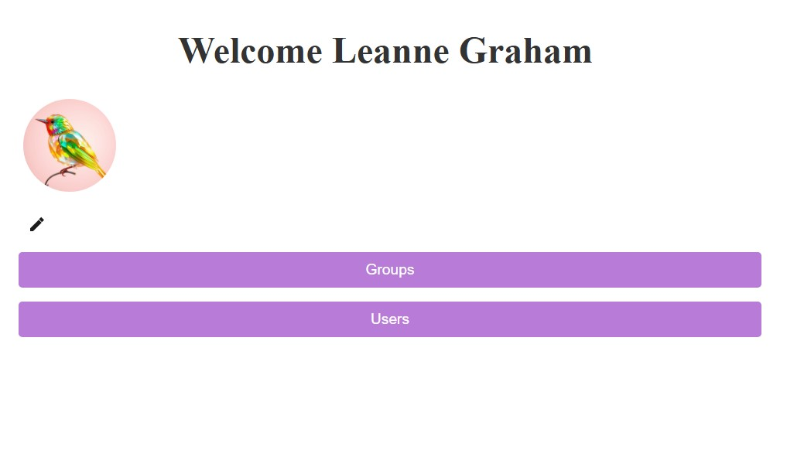

# MyWhatsapp

A React-based WhatsApp clone that allows registered users to chat, join or create groups, and manage profile images.

##  Login

Users must log in using data from:

👉 [https://jsonplaceholder.typicode.com/users](https://jsonplaceholder.typicode.com/users)

Only existing users from this endpoint can log in.

**Login Screen Example:**

---

##  Home Page

Once logged in, the user is directed to a homepage displaying their full name and profile picture.

From here, they can:

- Chat with individual users 💬  
- Join or create new groups 👥  
- Edit their own profile picture 🖼️  
- Edit group images 🎨  

**Home Page Example:**

---

##  Chat

Users can have real-time chats with other users or within groups.

**Chat Interface Example:**

---

##  Create & Edit Groups

Users can create new groups, give them names and images, and chat within them.

**Create Group Example:**

---

##  Technologies Used

- React
- JavaScript (ES6+)
- CSS
- JSONPlaceholder API

---

